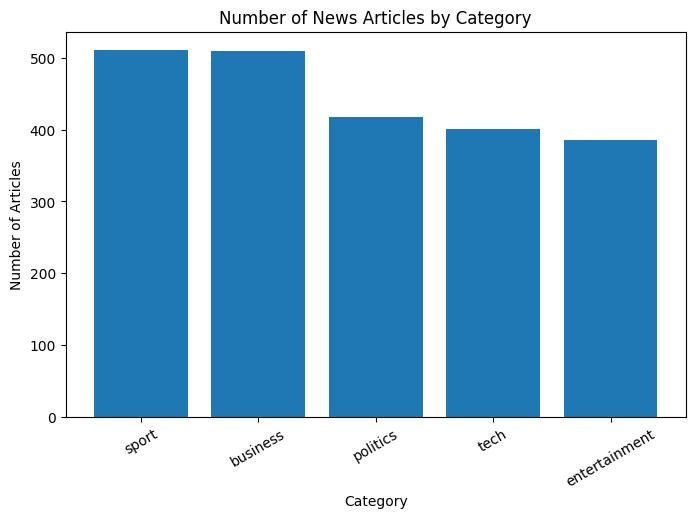
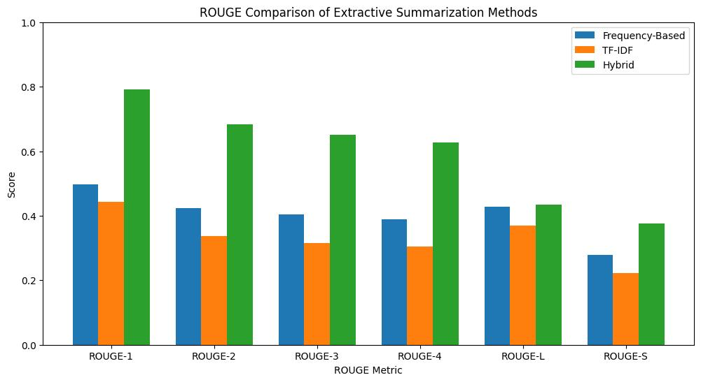
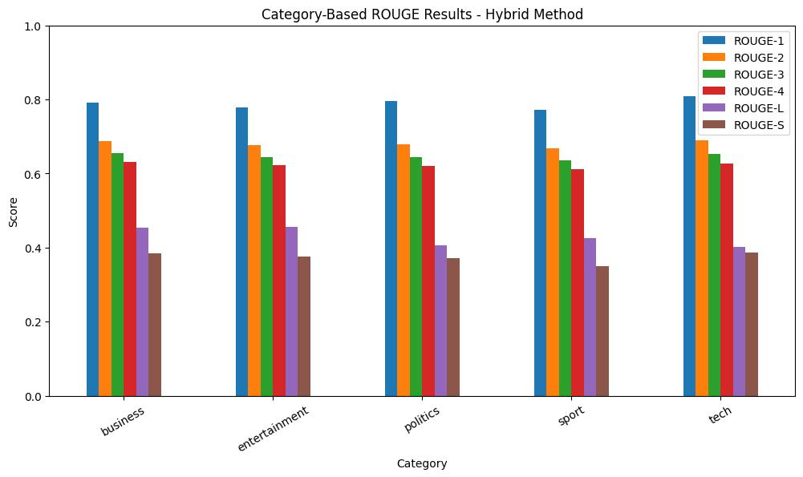

# Extractive Text Summarization System for News Texts

This project is an advanced Natural Language Processing (NLP) summarization system that extracts the most critical information from news articles using mathematical weighting (extractive summarization).

To overcome the limitations of traditional Word Frequency and TF-IDF methods, this project implements the 7-metric "Hybrid Sentence Scoring" algorithm proposed by Horasan & Bilen (2020) entirely from scratch in Python. Evaluated on the BBC News dataset, our custom model significantly outperforms the baseline ROUGE scores of the original paper, thanks to aggressive data preprocessing and the integration of modern NLTK libraries.

## Key Features
- **No Black-Box Libraries:** The mathematical model is built from scratch without relying on pre-built summarization tools.
- **7-Metric Evaluation:** Sentences are scored not just by word count, but by their structure, location, and semantic relevance.
- **Dynamic Thresholding:** Instead of selecting a fixed number of sentences, the system calculates the average score of all sentences in the text and only extracts the elite sentences that surpass this threshold.

## The 7 Scoring Metrics (Horasan-Bilen Hybrid Model)
The algorithm evaluates each sentence based on 7 distinct metrics to generate a final score:
1. **Term Frequency (TF):** Frequency of words in the sentence.
2. **Term Weighting (TW):** Weighted value of terms.
3. **Numerical Data (ND):** Presence of numerical figures (dates, percentages, money, etc.).
4. **Sentence Length (SL):** Length of the sentence relative to the longest sentence.
5. **Proper Nouns (PN):** Density of proper nouns (detected via NLTK `averaged_perceptron_tagger_eng`).
6. **Sentence Location (SLO):** The position of the sentence within the document.
7. **Sentence Similarity (SS):** Cosine similarity between the target sentence and the first/last sentences of the text.

## Dataset & Category Distribution
The system was tested on the BBC News Summary dataset, containing thousands of articles across 5 different categories (Business, Entertainment, Politics, Sport, Tech).



## Performance & Detailed ROUGE Scores
A sample size of 500 articles was used to benchmark the models. Our customized Hybrid Model achieved a massive leap across all ROUGE metrics (Unigram, Bigram, Trigram, etc.) compared to basic Frequency and TF-IDF methods:

| Method | Size | ROUGE-1 | ROUGE-2 | ROUGE-3 | ROUGE-4 | ROUGE-L | ROUGE-S |
| :--- | :---: | :---: | :---: | :---: | :---: | :---: | :---: |
| **Frequency-Based** | 500 | 0.49680 | 0.42366 | 0.40341 | 0.38963 | 0.42806 | 0.27969 |
| **TF-IDF** | 500 | 0.44400 | 0.33789 | 0.31576 | 0.30441 | 0.37037 | 0.22302 |
| **Horasan-Bilen Hybrid Model** | **500** | **0.79180** | **0.68442** | **0.65059** | **0.62718** | **0.43344** | **0.37599** |

### ROUGE Comparison Chart


### Category-Based Performance (Hybrid Model)
The algorithm's consistency was also tested individually across different news categories, maintaining high extraction accuracy universally.



> **Note:** The original academic paper reported average scores of ~0.68 for ROUGE-1 and ~0.47 for ROUGE-2. By implementing strict stop-words filtering and utilizing modern NLTK proper noun taggers during the preprocessing pipeline, our implementation successfully exceeded the original paper's accuracy levels.

## Installation & Usage

To run this project locally:

1. Clone the repository:
```bash
git clone [https://github.com/CinarSamet/extractive-news-summarizer.git](https://github.com/CinarSamet/extractive-news-summarizer.git)
```

2. Install the required dependencies:
```bash
pip install -r requirements.txt
```

3. Open the Jupyter Notebook located in the `notebooks/` directory and run the cells. The BBC dataset will be automatically downloaded via KaggleHub.

## Academic Reference
- Horasan, F., & Bilen, B. (2020). *Extractive Text Summarization System for News Texts.* International Journal of Applied Mathematics Electronics and Computers, 8(4), 179-184. 

## Future Works
- Transforming the core algorithm into a production-ready web application using **Streamlit** or **FastAPI**.
- Integrating more advanced NLP capabilities, such as Hidden Semantic Analysis, into the scoring metrics.